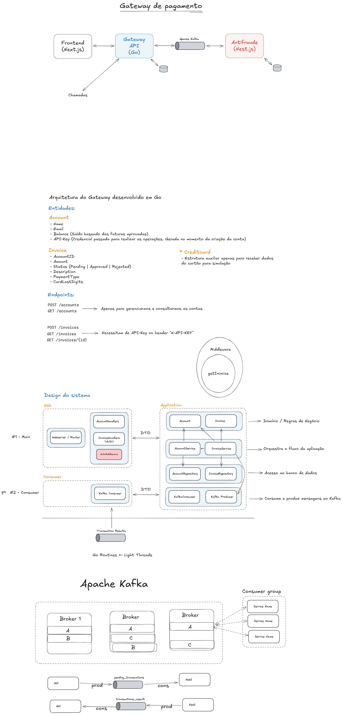
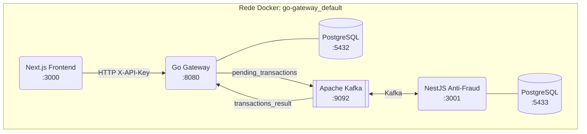
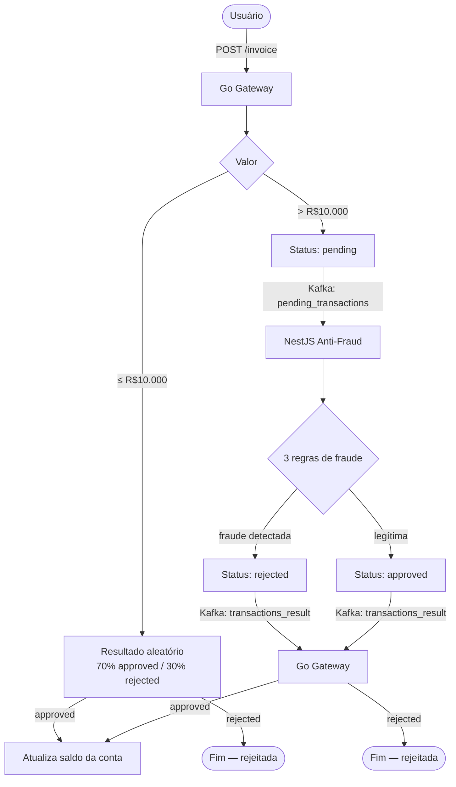

# Payment Gateway

Sistema distribuído de processamento de pagamentos com análise de fraude em tempo real.

## Serviços

| Serviço | Tecnologia | Porta | README |
|---|---|---|---|
| **Go Gateway** | Go 1.24 + chi | `8080` | [go-gateway/README.md](./go-gateway/README.md) |
| **NestJS Anti-Fraud** | NestJS 11 + Prisma | `3001` | [nestjs-anti-fraud/README.md](./nestjs-anti-fraud/README.md) |
| **Next.js Frontend** | Next.js 15 + React 19 | `3000` | [next-frontend/README.md](./next-frontend/README.md) |

## Arquitetura

Os três serviços compartilham a rede Docker `go-gateway_default`, criada pelo Go Gateway. Cada serviço tem seu próprio `docker-compose.yaml` — o Go Gateway deve ser iniciado primeiro pois é ele que cria a rede compartilhada e o Kafka.

## Fluxo de pagamento

## Detecção de fraude

O NestJS Anti-Fraud aplica três regras em sequência. Basta uma ser verdadeira para a transação ser **rejeitada**.

| # | Regra | Condição | Razão |
|---|---|---|---|
| 1 | **SuspiciousAccount** | Conta está marcada como suspeita | `SUSPICIOUS_ACCOUNT` |
| 2 | **UnusualAmount** | Valor > média histórica × (1 + variação%) | `UNUSUAL_PATTERN` |
| 3 | **FrequentHighValue** | Muitas transações nas últimas N horas | `FREQUENT_HIGH_VALUE` |

A regra 3, quando acionada, também marca a conta como suspeita — o que faz a regra 1 bloquear todas as transações futuras da mesma conta.

## Autenticação

O sistema usa **API Key** no lugar de login tradicional.

1. Uma conta é criada via `POST /accounts` no Go Gateway, que retorna uma `api_key`
2. O usuário acessa o frontend em `/login` e informa essa API Key
3. O frontend valida a chave chamando `GET /accounts` e armazena no cookie `apiKey`
4. Todas as requisições ao gateway incluem o header `X-API-Key`

## Kafka — Tópicos

| Tópico | Produzido por | Consumido por | Conteúdo |
|---|---|---|---|
| `pending_transactions` | Go Gateway | NestJS Anti-Fraud | `{ account_id, invoice_id, amount }` |
| `transactions_result` | NestJS Anti-Fraud | Go Gateway | `{ invoice_id, status }` |

## Infraestrutura

| Componente | Imagem | Porta |
|---|---|---|
| PostgreSQL (gateway) | `postgres:16-alpine` | `5432` |
| PostgreSQL (anti-fraud) | `postgres:16-alpine` | `5433` |
| Kafka | `confluentinc/cp-server:7.9.0` | `9092` |
| Confluent Control Center | `confluentinc/cp-enterprise-control-center:7.9.0` | `9021` |
