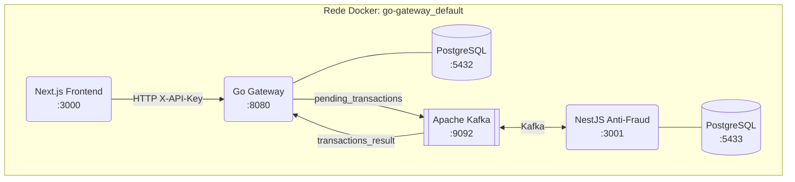
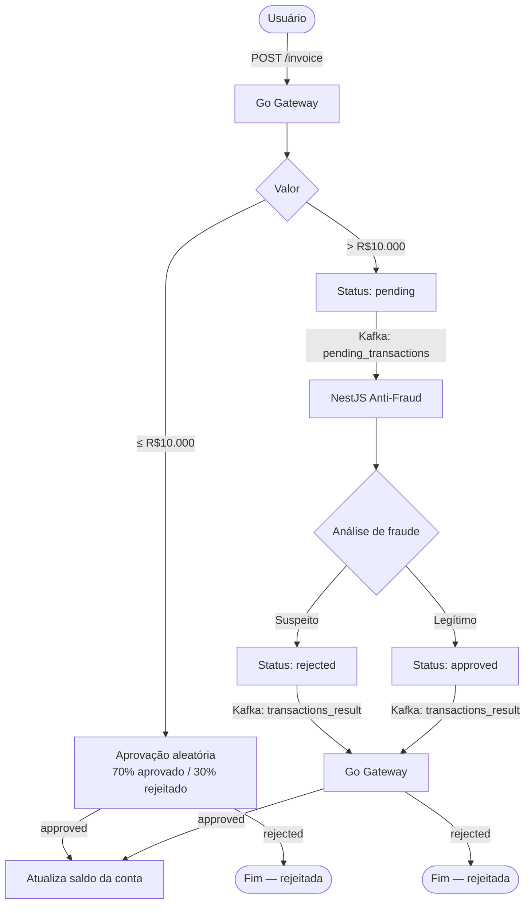

# Payment Gateway

Sistema de processamento de pagamentos distribuído com análise de fraude em tempo real, construído como uma arquitetura de microsserviços.

## Sumário

- [Visão Geral](#visão-geral)
- [Arquitetura](#arquitetura)
- [Serviços](#serviços)
  - [Go Gateway](#go-gateway)
  - [NestJS Anti-Fraud](#nestjs-anti-fraud)
  - [Next.js Frontend](#nextjs-frontend)
- [Fluxo de Processamento](#fluxo-de-processamento)
- [Kafka — Tópicos e Mensagens](#kafka--tópicos-e-mensagens)
- [API Reference](#api-reference)
  - [Accounts](#accounts)
  - [Invoices (Gateway)](#invoices-gateway)
  - [Invoices (Anti-Fraud)](#invoices-anti-fraud)
- [Banco de Dados](#banco-de-dados)
  - [Go Gateway (PostgreSQL)](#go-gateway-postgresql)
  - [Anti-Fraud (PostgreSQL + Prisma)](#anti-fraud-postgresql--prisma)
- [Detecção de Fraude](#detecção-de-fraude)
- [Autenticação](#autenticação)
- [Como Executar](#como-executar)
- [Variáveis de Ambiente](#variáveis-de-ambiente)

---

## Visão Geral

O **Payment Gateway** é uma plataforma para gerenciamento de contas e processamento de transações financeiras. Pagamentos de alto valor (acima de R$ 10.000) passam por análise assíncrona de fraude antes de serem confirmados. Toda a comunicação entre o gateway e o serviço de fraude ocorre via Apache Kafka.

---

## Arquitetura



Os três serviços compartilham a rede Docker `go-gateway_default`.

---

## Serviços

### Go Gateway

Ponto central de entrada do sistema. Escrito em Go, expõe a API REST, persiste contas e faturas, e orquestra a comunicação com o serviço de fraude via Kafka.

|                    |                                     |
| ------------------ | ----------------------------------- |
| **Linguagem**      | Go 1.24                             |
| **HTTP Router**    | `chi/v5`                            |
| **Banco de dados** | PostgreSQL 16                       |
| **Mensageria**     | Apache Kafka (`segmentio/kafka-go`) |
| **Porta**          | `8080`                              |

---

### NestJS Anti-Fraud

Serviço assíncrono de detecção de fraude. Consome mensagens do Kafka, aplica 3 estratégias de análise e publica o resultado de volta.

|                    |                                   |
| ------------------ | --------------------------------- |
| **Linguagem**      | TypeScript 5.7                    |
| **Framework**      | NestJS 11                         |
| **ORM**            | Prisma 6                          |
| **Banco de dados** | PostgreSQL 16 (instância própria) |
| **Mensageria**     | Confluent Kafka JS                |
| **Porta**          | `3001`                            |

---

### Next.js Frontend

Interface web para criação de contas, submissão e acompanhamento de faturas.

|                 |                           |
| --------------- | ------------------------- |
| **Linguagem**   | TypeScript 5              |
| **Framework**   | Next.js 15 + React 19     |
| **Estilização** | Tailwind CSS 4 + Radix UI |
| **Porta**       | `3000`                    |

**Rotas:**

| Rota               | Descrição                            | Autenticação |
| ------------------ | ------------------------------------ | ------------ |
| `/login`           | Criar ou recuperar conta pelo e-mail | Não          |
| `/invoices`        | Listar faturas da conta              | Sim          |
| `/invoices/create` | Criar nova fatura                    | Sim          |
| `/invoices/[id]`   | Detalhe de uma fatura                | Sim          |

---

## Fluxo de Processamento



---

## Kafka — Tópicos e Mensagens

### `pending_transactions`

Produzido pelo **Go Gateway** quando uma fatura com valor > R$10.000 é criada.

```json
{
  "account_id": "uuid",
  "invoice_id": "uuid",
  "amount": 15000.0
}
```

### `transactions_result`

Produzido pelo **NestJS Anti-Fraud** após análise da transação.

```json
{
  "invoice_id": "uuid",
  "status": "approved"
}
```

> Valores possíveis para `status`: `"approved"` | `"rejected"`

---

## API Reference

Todas as rotas de fatura exigem o header `X-API-Key` com a chave da conta.

### Accounts

#### Criar conta

```http
POST /accounts
Content-Type: application/json

{
  "name": "John Doe",
  "email": "john@example.com"
}
```

**Resposta `201`:**

```json
{
  "id": "uuid",
  "name": "John Doe",
  "email": "john@example.com",
  "balance": 0,
  "api_key": "a3f2...32 chars hex",
  "created_at": "2026-04-01T12:00:00Z",
  "updated_at": "2026-04-01T12:00:00Z"
}
```

#### Consultar conta autenticada

```http
GET /accounts
X-API-Key: {api_key}
```

**Resposta `200`:**

```json
{
  "id": "uuid",
  "name": "John Doe",
  "email": "john@example.com",
  "balance": 1250.5,
  "created_at": "2026-04-01T12:00:00Z",
  "updated_at": "2026-04-01T12:00:00Z"
}
```

---

### Invoices (Gateway)

#### Criar fatura

```http
POST /invoice
Content-Type: application/json
X-API-Key: {api_key}

{
  "amount": 150.00,
  "description": "Compra de produto X",
  "payment_type": "credit_card",
  "card_number": "4111111111111111",
  "cvv": "123",
  "expiry_month": 12,
  "expiry_year": 2027,
  "cardholder_name": "John Doe"
}
```

**Resposta `201`:**

```json
{
  "id": "uuid",
  "account_id": "uuid",
  "amount": 150.0,
  "status": "approved",
  "description": "Compra de produto X",
  "payment_type": "credit_card",
  "card_last_digits": "1111",
  "created_at": "2026-04-01T12:00:00Z",
  "updated_at": "2026-04-01T12:00:00Z"
}
```

> `status` pode ser `pending`, `approved` ou `rejected` dependendo do valor e análise de fraude.

#### Listar faturas

```http
GET /invoice
X-API-Key: {api_key}
```

**Resposta `200`:** array de objetos com o mesmo formato acima.

#### Consultar fatura por ID

```http
GET /invoice/{id}
X-API-Key: {api_key}
```

**Erros comuns:**

| Código | Situação                               |
| ------ | -------------------------------------- |
| `400`  | Parâmetros inválidos ou header ausente |
| `401`  | API Key não encontrada                 |
| `403`  | Fatura pertence a outra conta          |
| `404`  | Fatura não encontrada                  |

---

### Invoices (Anti-Fraud)

#### Listar faturas com histórico de fraude

```http
GET /invoices?with_fraud=true&account_id={id}
```

**Resposta `200`:**

```json
[
  {
    "id": "uuid",
    "accountId": "uuid",
    "amount": 15000.0,
    "status": "REJECTED",
    "createdAt": "2026-04-01T12:00:00Z",
    "account": {
      "id": "uuid",
      "isSuspicious": true
    },
    "fraudHistory": {
      "reason": "FREQUENT_HIGH_VALUE",
      "description": "Too many high-value transactions in a short period"
    }
  }
]
```

#### Consultar fatura por ID

```http
GET /invoices/{id}
```

---

## Banco de Dados

### Go Gateway (PostgreSQL)

```sql
CREATE TABLE accounts (
  id           UUID PRIMARY KEY DEFAULT gen_random_uuid(),
  name         VARCHAR(255) NOT NULL,
  email        VARCHAR(255) NOT NULL UNIQUE,
  api_key      VARCHAR(255) NOT NULL UNIQUE,
  balance      DECIMAL(10,2) NOT NULL DEFAULT 0,
  created_at   TIMESTAMP NOT NULL DEFAULT CURRENT_TIMESTAMP,
  updated_at   TIMESTAMP NOT NULL DEFAULT CURRENT_TIMESTAMP
);

CREATE TABLE invoices (
  id               UUID PRIMARY KEY DEFAULT gen_random_uuid(),
  account_id       UUID NOT NULL REFERENCES accounts(id),
  amount           DECIMAL(10,2) NOT NULL,
  status           VARCHAR(50)  NOT NULL DEFAULT 'pending',
  description      TEXT NOT NULL,
  payment_type     VARCHAR(50)  NOT NULL,
  card_last_digits VARCHAR(4),
  created_at       TIMESTAMP NOT NULL DEFAULT CURRENT_TIMESTAMP,
  updated_at       TIMESTAMP NOT NULL DEFAULT CURRENT_TIMESTAMP
);
```

### Anti-Fraud (PostgreSQL + Prisma)

```prisma
model Account {
  id          String    @id
  createdAt   DateTime  @default(now())
  updatedAt   DateTime  @updatedAt
  isSuspicious Boolean  @default(false)
  invoices    Invoice[]
}

model Invoice {
  id           String         @id
  accountId    String
  amount       Float
  status       InvoiceStatus
  createdAt    DateTime
  updatedAt    DateTime
  account      Account        @relation(fields: [accountId], references: [id])
  fraudHistory FraudHistory?
}

model FraudHistory {
  id          String      @id @default(uuid())
  invoiceId   String      @unique
  reason      FraudReason
  description String?
  createdAt   DateTime    @default(now())
  updatedAt   DateTime    @updatedAt
  invoice     Invoice     @relation(fields: [invoiceId], references: [id])
}

enum InvoiceStatus {
  APPROVED
  REJECTED
}

enum FraudReason {
  SUSPICIOUS_ACCOUNT
  UNUSUAL_PATTERN
  FREQUENT_HIGH_VALUE
}
```

---

## Detecção de Fraude

O serviço Anti-Fraud aplica três estratégias em sequência. Basta uma retornar fraude para que a transação seja **rejeitada**.

### 1. SuspiciousAccount

Verifica se a conta já está marcada como suspeita (`isSuspicious = true`).

```
Se account.isSuspicious → REJEITADO (razão: SUSPICIOUS_ACCOUNT)
```

### 2. UnusualAmount

Compara o valor da transação com a média histórica da conta.

```
média = média de todos os invoices anteriores da conta
limite = média × (1 + SUSPICIOUS_VARIATION_PERCENTAGE / 100)

Se amount > limite → REJEITADO (razão: UNUSUAL_PATTERN)
```

### 3. FrequentHighValue

Detecta padrão de muitas transações em curto espaço de tempo.

```
contagem = nº de invoices nos últimos SUSPICIOUS_TIMEFRAME_HOURS horas

Se contagem ≥ SUSPICIOUS_INVOICES_COUNT:
  → Marca a conta como isSuspicious = true
  → REJEITADO (razão: FREQUENT_HIGH_VALUE)
```

---

## Autenticação

O sistema usa **API Key** no lugar de autenticação tradicional por usuário/senha.

1. O usuário acessa `/login` e informa nome e e-mail
2. O frontend chama `POST /accounts` — cria a conta se não existir, ou a recupera
3. A `api_key` retornada é armazenada em cookie no navegador
4. Todas as requisições seguintes enviam `X-API-Key: {api_key}` no header

> A API Key é uma string hexadecimal de 32 caracteres gerada aleatoriamente no momento da criação da conta.

---

## Como Executar

### Pré-requisitos

- Docker e Docker Compose instalados

### 1. Subir o Go Gateway (com Kafka e PostgreSQL)

```bash
cd go-gateway
docker compose up -d
```

Isso inicializa:

- API Gateway em `http://localhost:8080`
- PostgreSQL em `localhost:5432`
- Kafka (KRaft, sem Zookeeper) em `localhost:9092`
- Confluent Control Center em `http://localhost:9021`
- Job de inicialização que cria os tópicos `pending_transactions` e `transactions_result`

### 2. Subir o NestJS Anti-Fraud

```bash
cd nestjs-anti-fraud
docker compose up -d
```

Isso inicializa:

- Anti-Fraud Service em `http://localhost:3001`
- PostgreSQL dedicado em `localhost:5433`
- Ambos conectados à rede `go-gateway_default`

### 3. Subir o Frontend

```bash
cd next-frontend
docker compose up -d
```

Acesse em `http://localhost:3000`.

---

## Variáveis de Ambiente

### Go Gateway

| Variável                  | Padrão                 | Descrição                |
| ------------------------- | ---------------------- | ------------------------ |
| `HTTP_PORT`               | `8080`                 | Porta do servidor HTTP   |
| `DB_HOST`                 | `db`                   | Host do PostgreSQL       |
| `DB_PORT`                 | `5432`                 | Porta do PostgreSQL      |
| `DB_USER`                 | `postgres`             | Usuário do banco         |
| `DB_PASSWORD`             | `postgres`             | Senha do banco           |
| `DB_NAME`                 | `gateway`              | Nome do banco            |
| `DB_SSL_MODE`             | `disable`              | Modo SSL                 |
| `KAFKA_BROKER`            | `localhost:9092`       | Endereço do broker Kafka |
| `KAFKA_PRODUCER_TOPIC`    | `pending_transactions` | Tópico de saída          |
| `KAFKA_CONSUMER_TOPIC`    | `transactions_result`  | Tópico de entrada        |
| `KAFKA_CONSUMER_GROUP_ID` | `gateway-group`        | Consumer group ID        |

### NestJS Anti-Fraud

| Variável                          | Descrição                                            |
| --------------------------------- | ---------------------------------------------------- |
| `DATABASE_URL`                    | Connection string do PostgreSQL                      |
| `SUSPICIOUS_VARIATION_PERCENTAGE` | Variação percentual para considerar valor incomum    |
| `INVOICES_HISTORY_COUNT`          | Quantidade de faturas históricas para calcular média |
| `SUSPICIOUS_INVOICES_COUNT`       | Mínimo de faturas em curto prazo para acionar alerta |
| `SUSPICIOUS_TIMEFRAME_HOURS`      | Janela de tempo (horas) para análise de frequência   |
